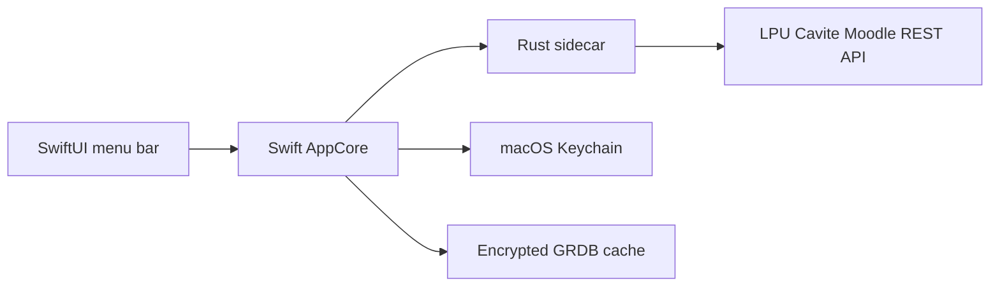

<p align="center">
  
</p>

<h1 align="center">Pipo</h1>

<p align="center">
  A quiet macOS menu-bar companion for LPU Cavite students.
</p>

<p align="center">
  
  
  
  <a href="https://github.com/Jazztinn/pipo/actions/workflows/ci.yml"></a>
  <a href="LICENSE"></a>
</p>

<p align="center">
  <a href="#features">Features</a> ·
  <a href="#install">Install</a> ·
  <a href="#how-it-works">How it works</a> ·
  <a href="#development">Development</a> ·
  <a href="#privacy">Privacy</a>
</p>

Pipo keeps upcoming work, course activity, and published feedback within reach
from the macOS menu bar. It is designed around two rules: **less input, more
interaction** and **convenience without burden**.

Pipo is an independent student project. It is not affiliated with or endorsed
by Lyceum of the Philippines University.

## Features

- **Next Up** ranks overdue work, near deadlines, scheduled events, and unseen announcements.
- **Today** groups due work, schedule, announcements, messages, grades, and recent resources.
- **Courses** shows enrolled subjects, upcoming counts, published totals, assignments, and LMS links.
- **Quick actions** open the LMS, copy details, mark items seen, snooze reminders, and add events to Apple Calendar.
- **Local controls** support course pinning, hiding, search, filters, quiet hours, and notification categories.
- **Offline snapshots** retain the most recent successful dashboard and show its age.
- **In-place updates** use Sparkle with Stable and Beta channels.
- **Secure storage** keeps the LMS token and cache key in one macOS Keychain vault.

Unsupported Moodle capabilities stay hidden. Pipo never simulates missing LMS
features or writes changes to Moodle.

## Install

1. Download the latest DMG from [GitHub Releases](https://github.com/Jazztinn/pipo/releases/latest).
2. Open the DMG and drag **Pipo** into **Applications**.
3. Launch Pipo and sign in with your LPU Cavite LMS account.
4. Use the flag in the menu bar to open the dashboard.

> [!NOTE]
> Current builds are distributed without Apple notarization. macOS may require
> a manual approval in **System Settings → Privacy & Security** on first launch.

After installation, use **Settings → Updates → Check for updates**. Pipo can
download approved releases without requiring another DMG installation.

## How it works



1. `PipoApp` provides the application window, menu-bar shell, and Sparkle updater.
2. `PipoUI` renders the dashboard, course views, onboarding, and Settings.
3. `PipoAppCore` coordinates refreshes, encrypted state, notifications, Calendar actions, and URL policy.
4. The Rust `pipo-core` sidecar discovers advertised Moodle capabilities and normalizes read-only responses.
5. Every browser destination is restricted to `https://lms.lpucavite.edu.ph`.

The sidecar protocol and privacy boundaries are documented in
[`docs/architecture`](docs/architecture) and [`docs/security`](docs/security).

## Technology

| Layer | Technology |
|---|---|
| Interface | SwiftUI and AppKit |
| Application core | Swift Concurrency, Observation, EventKit, CryptoKit |
| LMS integration | Rust, Reqwest, Tokio, Serde |
| Local persistence | GRDB with AES-GCM payload encryption |
| Updates | Sparkle 2 |
| Automation | GitHub Actions |

## Development

### Requirements

- macOS 14 or later
- Swift 6.3 or later
- Rust 1.88 or later
- Full Xcode for application bundles

Run the test suites:

```sh
swift test
cargo test --workspace --manifest-path rust/Cargo.toml
```

Run Pipo from source:

```sh
cargo build --manifest-path rust/Cargo.toml --bin pipo-core
PIPO_CORE_PATH="$PWD/rust/target/debug/pipo-core" swift run PipoApp
```

Build an installable local application:

```sh
scripts/build-local-beta.sh
scripts/build-dmg.sh dist/Pipo.app dist/Pipo.dmg
```

### Project structure

```text
pipo/
├── app/
│   ├── Resources/              # Icon, Info.plist, and DMG artwork
│   ├── Sources/PipoApp/        # macOS application and updater
│   ├── Sources/PipoAppCore/    # State, storage, refresh, and integrations
│   ├── Sources/PipoUI/         # Dashboard and Settings views
│   └── Tests/                  # Swift core and UI tests
├── rust/pipo-core/             # Moodle client and sidecar protocol
├── contracts/                  # Versioned dashboard schema
├── fixtures/                   # Redacted Moodle response fixtures
├── docs/                       # Architecture, product, release, and security notes
└── scripts/                    # Build, DMG, verification, and release tools
```

## Privacy

- Pipo connects only to the fixed LPU Cavite LMS origin.
- Moodle access is read-only.
- The LMS password is exchanged for a token and is never persisted.
- The token and cache-encryption key live in macOS Keychain.
- Cached dashboard data and local interaction state are encrypted on device.
- Message bodies and grades are excluded from macOS notification text.
- Diagnostics redact tokens, identity, grades, excerpts, and message bodies.
- Signing keys and student credentials must never enter commits, fixtures, logs, or issues.

See [SECURITY.md](SECURITY.md) for reporting and support boundaries.

## Scope

Pipo currently supports one LPU Cavite LMS account. MyLycean grade import, SGPA
estimates, Dean's List checks, multiple schools, and Moodle write actions remain
outside the current release.

## Acknowledgements

Pipo imports selected Moodle integration work from
[`ALinuxPerson/openlms-mcp`](https://github.com/ALinuxPerson/openlms-mcp) under
the MIT License. Imported paths and the upstream revision are recorded in
[UPSTREAM.md](UPSTREAM.md). Additional notices are listed in
[THIRD_PARTY_NOTICES.md](THIRD_PARTY_NOTICES.md).

## License

Pipo is available under the [MIT License](LICENSE).
